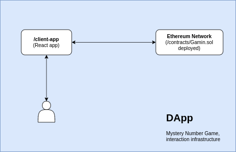

# Mystery number game

This is a game DApp created with a Smart Contract Ethereum and UI client with React.

The interaction of the project is represented in the following way:


## Getting Started

These instructions will get you a copy of the project up and running on your local machine.

### Prerequisites

- node.js
- npm
- truffle

### Installing

#### With make (Unix)

- Compile, migrate, and Deploy Contract and App React

  ```bash
  make start
  ```

  > this option only works with Unix environments with `make` installed.

#### Compile/Migrate manually

- Compile and migrate the contract

  ```bash
    truffle migrate
    cp ./build_contract/contracts/Gaming.json ./client-app/src/contracts-api/artifacts/Gaming.json
  ```

  > this will create a build folder and copy to client react.

- Installing Dependencies in client Application
  ```bash
  cd ./client-app && npm install
  npm start
  ```

### Running the test

#### Migrating with Truffle Ethereum test network

- Active truffle Develop mode.
  ```bash
    truffle develop
  ```
  on truffle prompt:
  ```bash
    truffle(develop)> test
  ```

#### Migrating using an alternative GUI blockchain wiht Ganash

For that it's necessary to have [Ganash software](https://www.trufflesuite.com/ganache) installed.

- Migrate the contract to the network.

  ```bash
    truffle migrate
  ```

  > check the configuration in `truffle-config.js`

- Run the tests.

  ```bash
     truffle test
  ```

  or intereacting with the console

  ```bash
   truffle console
   truffle(development)> test
  ```

## Built With

- **Smart Contract**

  - [Truffle Framework](https://www.trufflesuite.com/docs/truffle/overview)

- **Client Application**
  - [React v17](https://github.com/facebook/create-react-app)

## References

- Ethereum and Solidity the complete developers guide, [Udemy Course](https://www.udemy.com/course/ethereum-and-solidity-the-complete-developers-guide)
- Hands-On Blockchain Development [(Book By Will, 2019)](https://amzn.to/3699xh1)
